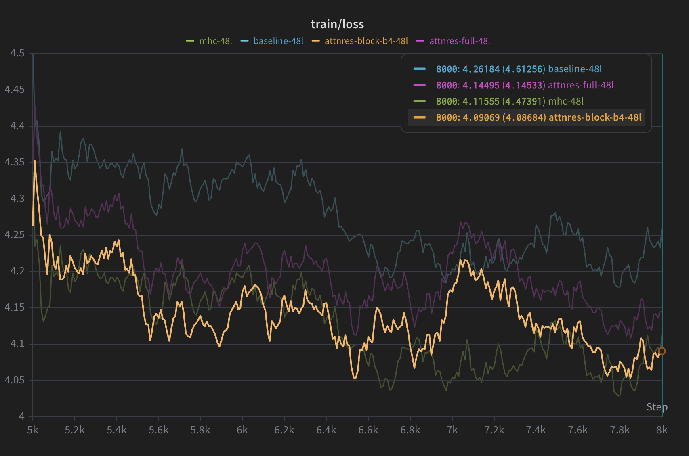

# 48L Late Train-Loss Window

This report captures a late-training comparison window for the shared 48-layer / ~1B-token matrix:

- `baseline-48l`
- `mhc-48l`
- `attnres-full-48l`
- `attnres-block-b4-48l`

Expected image path in this folder:

- `train-loss-step-7000-8000.png`

## What This Figure Is

The screenshot shows the W&B `train/loss` chart over the late-training window from roughly step `7000` to `8000` for the first complete four-run 48-layer matrix.

This is a mechanism-level comparison inside this repo's dense nanoGPT setting, not a direct reproduction of the official large-scale paper training stacks.

## Run Set

| Method | W&B run | Config | Output dir | Params |
| --- | --- | --- | --- | ---: |
| baseline | `baseline-48l` | `examples/nanogpt/config/train_fineweb10B_48l.py` | `out-fineweb10B-48l-baseline-blackwell8` | 20,673,750 |
| mHC | `mhc-48l` | `examples/nanogpt/config/train_fineweb10B_mhc_48l.py` | `out-fineweb10B-mhc-48l-blackwell8` | 22,234,038 |
| Full AttnRes | `attnres-full-48l` | `examples/nanogpt/config/train_fineweb10B_attnres_full_48l.py` | `out-fineweb10B-attnres-full-48l-blackwell8` | 20,702,850 |
| Block AttnRes | `attnres-block-b4-48l` | `examples/nanogpt/config/train_fineweb10B_attnres_block_48l.py` | `out-fineweb10B-attnres-block-b4-48l-blackwell8` | 20,702,850 |

All four runs share the same backbone family and training budget:

- `n_layer=48`
- `n_head=6`
- `n_embd=150`
- `block_size=1024`
- `target_tokens_per_iter=131072`
- `target_tokens=1048576000`

This means the matrix is controlled by backbone and token budget; the residual mechanism is the intended ablation.

## W&B Links

- baseline: <https://wandb.ai/ahm-rimer/nanogpt-attnres-repro/runs/edc442iy>
- mHC: <https://wandb.ai/ahm-rimer/nanogpt-attnres-repro/runs/fhbevqhp>
- Full AttnRes: <https://wandb.ai/ahm-rimer/nanogpt-attnres-repro/runs/47bvkspf>
- Block AttnRes: <https://wandb.ai/ahm-rimer/nanogpt-attnres-repro/runs/kq0pqw4k>

## Final Metrics For These Runs

| Method | Final step | Tokens seen | Train loss | Eval train loss | Val loss |
| --- | ---: | ---: | ---: | ---: | ---: |
| baseline | 8000 | 1,048,576,000 | 4.2083 | 4.2387 | 4.2451 |
| mHC | 8000 | 1,048,576,000 | 4.0484 | 4.0807 | 4.0837 |
| Full AttnRes | 8000 | 1,048,576,000 | 4.1453 | 4.1642 | 4.1615 |
| Block AttnRes | 8000 | 1,048,576,000 | 4.0868 | 4.1118 | 4.1059 |

## How This Fits The Official Papers

### AttnRes paper

The official Attention Residuals report evaluates the method mainly in Moonshot's Kimi Linear stack and larger scaling-law settings, not in a small dense nanoGPT reproduction. So this figure is not a paper-level reproduction in the original systems context.

What *is* comparable here is the mechanism-level claim:

- Full AttnRes and Block AttnRes can be isolated on a shared dense backbone
- Block AttnRes is the practical approximation that should preserve most of the benefit while using less memory

This late-window plot is directionally consistent with the paper's practical story because Block AttnRes is at least competitive with, and here slightly better than, Full AttnRes in the final part of training.

### mHC paper

The mHC paper is also not evaluated in this exact dense nanoGPT harness. So this figure is again a mechanism-level repro result, not a direct paper result.

Within this repo's setup, mHC is the strongest curve in this late training window and also the best final validation loss among these four runs.

## Interpretation

From the figure and final metrics:

1. `mHC` is the strongest of the four runs in the late-training regime shown here.
2. `Block AttnRes` is the best AttnRes variant in this matrix and clearly outperforms the baseline.
3. `Full AttnRes` improves on the baseline, but it is weaker than `Block AttnRes` in this run family.
4. `baseline` is the weakest of the four curves in the final part of training.

That ordering by final validation loss is:

`mHC < Block AttnRes < Full AttnRes < baseline`

## Caveats

- This is a single-seed comparison.
- The plot is a late-window `train/loss` view, not the entire training trajectory.
- The official AttnRes paper's strongest evidence comes from a different architecture and much larger training setup.
- The mHC path in this repo is very close to the paper, but still has some remaining literal-paper deltas discussed elsewhere in the repo audit notes.

## Suggested Use

Use this report as:

- a tracked snapshot of a meaningful four-run comparison window
- a quick reference for W&B links and final metrics
- supporting evidence for why Block AttnRes deserves to remain in the main matrix

Do not use it as the sole basis for paper-level conclusions without additional seeds, larger models, or broader evaluation.
